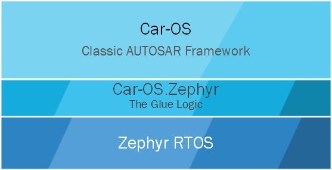

# Car-OS.Zephyr
The Car here stands for <u>C</u>lassic <u>a</u>utosa<u>r</u>. And the OS.Zephyr means Operating System software on top of Zephyr RTOS. This means Car-OS runs on top of Zephyr, which is akin to Android on top of Linux. 



<br>

This project is created this way for following reasons:
 * Zephyr OS supports variety of boards and therefore this project can easily support any hardware with little effort.
 * And MCALs (on AUTOSAR BSW) will use Zephyr RTOS's standard interfaces. So, no business of updating MCALs ($$ savings) across micros, henceforth.
 * People working on this project can focus on new ideas or on AUTOSAR specs than re-doing what Zephyr OS team had done it.
 * [Linux Foundation is making effort to get Safety (SIL3) certification](https://www.zephyrproject.org/update-safety-standard-compliance/). So this work could/will be used on Cars one day.


<br>

# Getting Started
## Linux

### Pre-requisites
 * Setup zephyr project and SDK as given in https://docs.zephyrproject.org/latest/develop/getting_started/index.html
   * Preferably use Linux machine and setup in $HOME directory.


### Setup and Build
 * `cd <base-path>`
 * `git clone --recurse-submodules -j4 https://github.com/aananthcn/Car-OS.Zephyr`
 * `cd Car-OS.Zephyr/`
 * `source ~/zephyrproject/.venv/bin/activate`
 * `source ~/zephyrproject/zephyr/zephyr-env.sh`
 * `python python car-os/tools/autosar-gui.py`
   * Import **Car-OS.arxml** file using `File->Import ARXML File` menu.
   * Click the Micro-Controller block and configure the microcontroller (_right now only RaspberryPi Pico is supported_)
   * Click the Zephyr RTOS block and configure the zephyrproject path
   * Select menu `Generate->Generate Source` to generate source files.
 * `west build -b rpi_pico .`

For further reading: https://blog.golioth.io/how-to-build-your-zephyr-app-in-a-standalone-folder/

<br>

## MSYS2 on Windows

### Pre-requisites
 * Setup MSYS2 as described in https://www.msys2.org/
 * Update pacman packages & database
   * `pacman -Syy`
   * `pacman -Syu`
 * Install packages as described below
   * `pacman -S make mingw-w64-x86_64-cmake mingw-w64-x86_64-gcc mingw-w64-x86_64-python3 python3-pip mingw-w64-x86_64-python-ruamel-yaml mingw-w64-x86_64-ninja mingw-w64-x86_64-gperf mingw-w64-x86_64-wget mingw-w64-x86_64-7zip`
 * Setup zephyr project and SDK as given in https://docs.zephyrproject.org/latest/develop/getting_started/index.html
   * Preferably create a new partion in windows (E: or D:) and install it there. Here are some example steps that you can follow, however please follow the link above for detailed steps:
     * `west init zephyrproject`
     * `cd zephyrproject`
     * `west update`
     * `west zephyr-export`
     * `pip install -r <d:_or_e:_path>\zephyrproject\zephyr\scripts\requirements.txt`
       * Note: you will find an error "`ERROR: No matching distribution found for windows-curses`". You can safely ingore it for now.
   * Setup SDK
     * `wget https://github.com/zephyrproject-rtos/sdk-ng/releases/download/v0.16.4/zephyr-sdk-0.16.4_windows-x86_64.7z`
     * `7z x zephyr-sdk-0.16.4_windows-x86_64.7z`


### Setup and Build
 * `cd <base-path>`
 * `git clone --recurse-submodules -j4 https://github.com/aananthcn/Car-OS.Zephyr`
 * `cd Car-OS.Zephyr/`
 * `bash`
 * `source e:/zephyrproject/zephyr/zephyr-env.sh`
 * `python python car-os/tools/autosar-gui.py`
   * Import **Car-OS.arxml** file using `File->Import ARXML File` menu.
   * Click the Micro-Controller block and configure the microcontroller (_right now only RaspberryPi Pico is supported_)
   * Click the Zephyr RTOS block and configure the zephyrproject path
   * Select menu `Generate->Generate Source` to generate source files.
 * `west build -b rpi_pico .`

<br>

## Development Setup - HARDWARE:
----


* Raspberry Pi Pico with pins soldered => [check this link](https://robocraze.com/products/raspberry-pi-pico-with-headers-and-micro-usb-cable)
* Cytron Maker Pi Pico Base => [check this link](https://robu.in/product/cytron-maker-pi-pico-base-without-pico/)
* DTech FTDI USB to TTL Serial Converter => [Amazon: PL2303TA chip](https://amzn.eu/d/eYsRoTC)
  * Note for Win11: Install driver from this link [prolific-driverinstaller-v1200](https://www.driverscloud.com/en/services/GetInformationDriver/72590-84992/delock-pl2303-prolific-driverinstaller-v1200zip)
* Any debugger with SWD pin interface support => [check this link](https://in.rsdelivers.com/product/segger/80800-j-link-base/segger-j-link-base-emulator/1311319)
  * Also planning to support ELF to UF2 image conversion so that developers can flash the image and use print statements to see the debug output.
  * For SWD, buy 20 pin JTAG cable and cut & crimp it for SWD => [check this link](https://robu.in/product/2-54mm-pitch-20-pin-jtag-isp-avr-cable/)
* 2 x Grove 4-pin => [check this link](https://www.fabtolab.com/grove-universal-cable?search=grove%204%20pin)
* ENC28J60 Ethernet LAN controller => [check this link](https://robocraze.com/products/enc28j60-ethernet-lan-module)


## Segger Debug Notes
* Select RP2040_M0_0 as target device.
* If you get "Memory read failure" while watching global variables, then set `Project -> Options -> Debugger -> Restrict Memory Access` ==> `No`. 
<br><br>


# Architecture Decisions
## The structure of Car-OS.Zephyr
### The Foundation
As described in the top of this page, the foundation of Car-OS is Zephyr RTOS. It is (and will be) used as a hardware abstraction layer. And currently following boards are supported
1. rpi_pico

### The Glue Logic
The c source files in src folder forms the glue logic. That is, these modules binds the uppper Car-OS (i.e., the modified NammaAUTOSAR) to the bottom layer (i.e., Zephyr RTOS). This layer directly calls the functions, configurations and APIs exported by Car-OS layer.

The Car-OS layer is built separately as a library using the Makefile method, as a library named libCar_OS.la file. And finally linked with Zephyr RTOS by the Zephyr build system using west commands (see Getting Started section of this page for details)

##### The glue stuff in cMake code to do the same
Refer: https://github.com/zephyrproject-rtos/zephyr/blob/main/samples/application_development/external_lib/CMakeLists.txt
 * CMakeLists.txt additions 
    ```
    # Custom target for Car-OS.Zephyr
    add_custom_target(
      Car_OS
      COMMAND make 
      WORKING_DIRECTORY ${CMAKE_CURRENT_SOURCE_DIR}/car-os/
      BYPRODUCTS libCar_OS.la
    )
    add_library(libCar_OS STATIC IMPORTED)
    add_dependencies(libCar_OS Car_OS)
    target_link_libraries(libCar_OS INTERFACE debug libCar_OS)
    set_target_properties(libCar_OS PROPERTIES IMPORTED_LOCATION ${CMAKE_CURRENT_SOURCE_DIR}/car-os/libCar_OS.la)
    ```

## Won't compilation of two objects cause run-time issues?
Basically yes, this project had already seen it during the testing because the architecture options were different and Zephyr traps such code execution. But when we use the same compiler and keep the compiler options same and then integration of two differnetly built objects can work without issues. It is tested too.

 * Following cflags are used by rpi_pico to build zephyr.elf
   * `-mcpu=cortex-m0plus -mthumb -mabi=aapcs -mfp16-format=ieee -mtp=soft`
   * And the same is also used for building libCar_OS.la

## AUTOSAR Tasks on Car-OS.Zehyr
To schedule AUTOSAR tasks I have 2 options in hand:
 1. **OPTION-1**: To use the NammaAUTOSAR's way of calling functions, i.e., get a timer ISR and then control the scheduling tasks by inspecting the OS_Config structure and the TaskControlBlock structure.
 2. **OPTION-2**: By using the kernel thread APIs of Zephyr RTOS (samples listed below):
    * k_thread_create()
    * k_thread_suspend()
    * k_thread_resume()
    * ...

The decision is to go with OPTION-2 because of following reasons:
1. The scheduling is more complex and if I use the Zephyr's implementations, then I get
   * Better performance (includes lesser Flash space)
   * Lesser development efforts (including defect fixes)
2. Using the native APIs will set a path way to integrate both AUTOSAR and non-AUTOSAR applications together and their behaviors will be same.
